<p align="center">
  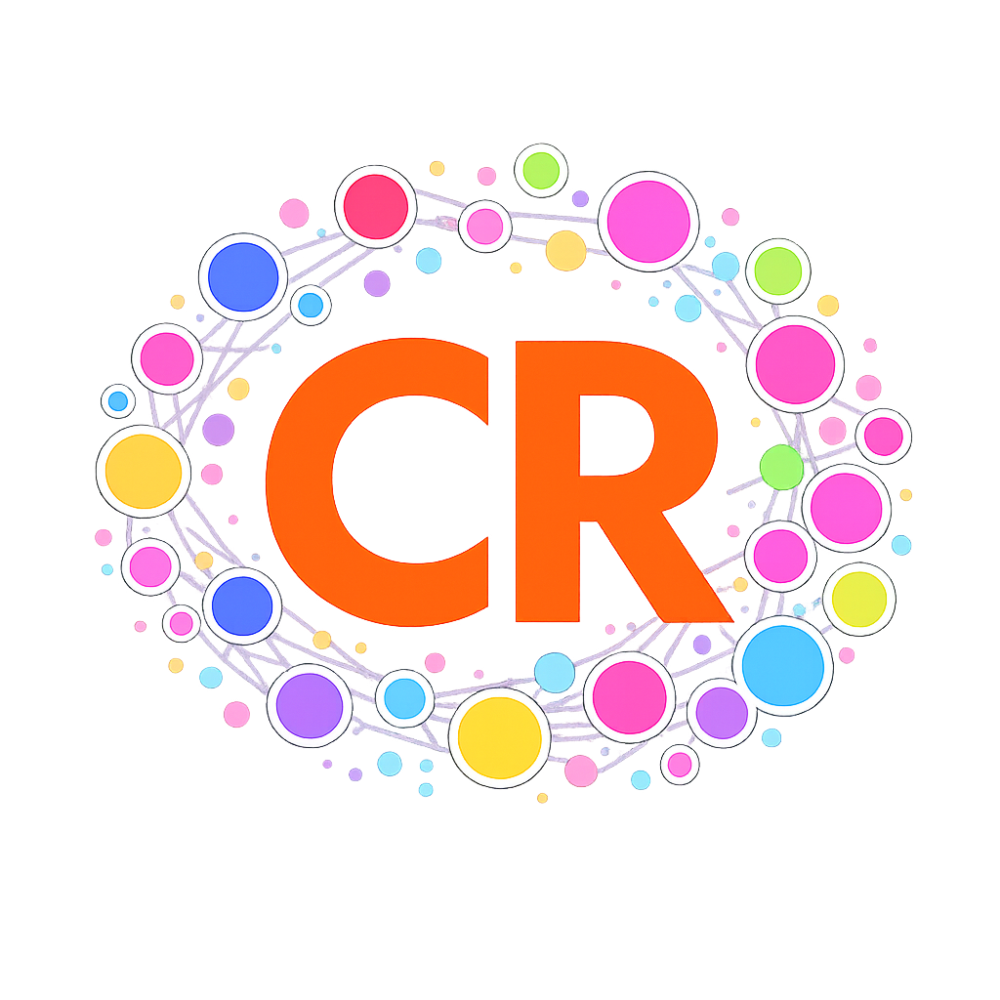
</p>

<h1 align="center">ConceptRadar</h1>
<p align="center"><em>A Google Maps for Concepts — Navigate the World's Knowledge Through Trust, Novelty, Momentum, and Relationships</em></p>

<p align="center">
  
  
</p>
<p align="center">
  
  
  
  
</p>

---

## 🎯 What is ConceptRadar?

ConceptRadar is a **knowledge intelligence system** that continuously scouts, scores, and visualizes emerging concepts — currently focusing on **AI** and related fields.

It answers the question every researcher and strategist asks: **"What's established, and where are the speculative opportunities?"**

### Why This Matters — Agents for Good

Good ideas don't only come from prestigious institutions. A researcher in a remote location, an independent thinker without academic affiliations, a practitioner with real-world insight — all of them can contribute concepts that reshape a field. Yet traditional publishing gatekeeps who gets seen.

**ConceptRadar removes that barrier.** Anyone can submit an idea through the Idea Sandbox — no credentials required, no journal fees, no peer-review gatekeeping. The system evaluates concepts purely on merit: How novel is this? How well does it hold up against existing knowledge? What does it connect to?

This democratization of knowledge visibility isn't just fair — it's a **security imperative**. Diverse perspectives surface blind spots. When only a narrow set of institutions control what counts as "knowledge," entire classes of risks go undetected. **Diversity strengthens the knowledge graph, and a stronger knowledge graph strengthens security.**

### The Problem

- Research papers, white papers, blogs, and news flood us daily
- 95% of "novel" concepts are incremental variations of known work
- No tool separates truly frontier concepts from established ones — at scale, **fully autonomously, without a human in the loop**
- This autonomous operation is itself the next frontier, demanding built-in safety and security measures for fully automated knowledge systems

### The Solution

ConceptRadar uses a **multi-agent architecture** with a **MITL (Model-in-the-Loop)** decision pattern and **4-dimensional scoring** to continuously map the knowledge landscape.

#### User Features

- **🔍 Scout** — Human-prompted discovery: enter a research topic and the system searches the web, evaluates, scores, classifies, and ingests relevant concepts autonomously
- **📎 Add Source** — Submit a URL to any research paper, blog post, or repository for full ingestion and scoring
- **💡 Idea Sandbox** — Submit your own original concept in a private sandbox. The system evaluates and scores it against all existing knowledge, then lets you promote it to the public graph — with or without attribution — or delete it without any traces, fully respecting your privacy
- **📡 Chat** — Ask the built-in AI research assistant about the landscape, compare concepts, or explore domains

#### Views

- **Radar View** — Interactive 2D graph plotting concepts by Novelty (X) × Validation (Y)
- **List View** — Sortable domain and category table with aggregated metrics (novelty, validation, momentum, reach, document count). Click a category to open its topic radar
- **Detail Card** — Click any concept to open its card with AI-generated summary, all scores, source link, and taxonomy position

#### User-Friendly UX

- Concepts with high momentum appear as **larger circles** on the radar
- Recently scouted concepts pulse with a **breathing animation**, making it easy to spot what's new
- The **chatbot** provides natural-language access to the entire knowledge graph — ask questions, compare concepts, or request deep analysis

---

## 📊 The 4 Scoring Dimensions

Every concept on the radar is scored across four dimensions:

### Novelty Score (X-axis)
*How genuinely new is this concept?*

A 3-component percentile-normalized score:

- **LLM Reasoning** (50%) — A reasoning model (Gemini 2.5 Flash) judges each concept's novelty compared to its direct peers in the same topic
- **Shannon Entropy** (25%) — Measures the diversity of a concept's connections across the knowledge graph. This captures the *structural information* of the graph topology — not the content of any single concept, but how it's woven into the broader landscape
- **Structural Surprise** (25%) — Measures how rare the specific cross-topic bridges are. A concept forging connections between topics that rarely link scores high — reflecting genuinely novel integration of previously disconnected fields

All three components are percentile-normalized independently → guaranteed full [0, 1] range with no systematic skew.

<details>
<summary><strong>📈 How we got here — Novelty Model Evolution</strong></summary>

The novelty scoring went through three iterations to achieve accurate concept separation:

| Phase | Formula | Problem |
|-------|---------|---------|
| **V1** (Cosine + LLM) | `0.3 × cosine + 0.7 × LLM` | Cross-disciplinary concepts crashed (e.g., "Governance of InterAgentic AI" scored 0.26) |
| **V2** (Entropy + LLM) | `0.4 × entropy + 0.6 × LLM` | Fixed cross-disciplinary but compressed range — 94% scored above 0.5 |
| **V3** (3-Component) | `0.50 × LLM + 0.25 × entropy + 0.25 × surprise` | ✅ Full spectrum, healthy distribution |

Key insight: adding **Structural Surprise** and **percentile-normalizing all components independently** eliminated systematic skew.

| Metric | 2-component | 3-component |
|--------|-------------|-------------|
| Above 0.5 (Frontier) | 94% ⚠️ | 44% ✅ |
| Score range | Compressed | Full [0, 1] |
| Cross-disciplinary accuracy | Poor | Accurate |

</details>

### How to Read the Radar — The 4 Quadrants

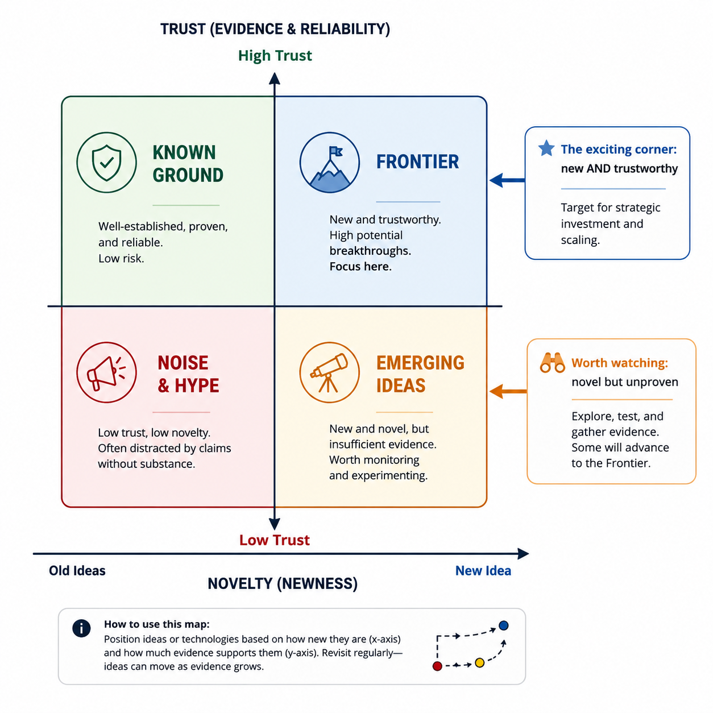

Concepts move across quadrants over time as evidence accumulates. Today's *Emerging Idea* may become tomorrow's *Frontier* — or fade into *Noise*.

### Validation Score (Y-axis)
*How trustworthy is this concept?*

Combines source credibility, citation signals, and content quality metrics. Peer-reviewed papers score higher than blog posts; established institutions add weight. This is the "trust" axis — separating well-evidenced concepts from speculative ones. Speculative concepts are a key feature: they represent potential opportunities that can be detected *before* they become established, with the inherent risk that validation may not follow. Time will tell.

### Momentum Score (Size)
*Is this concept gaining traction?*

Based on engagement metrics (GitHub stars/forks, citation counts, community activity) and topic cluster size — larger topics indicate trending research areas. Concepts with high momentum appear as **larger circles** on the radar. Reach also feeds back into momentum, rewarding concepts that bridge distant knowledge domains.

### Reach
*How far does this concept's influence extend across the knowledge landscape?*

Weights each of a concept's connections by taxonomic distance: cross-domain connections count far more than same-topic links, with cross-category and cross-topic links in between. This rewards concepts that bridge distant knowledge domains over those that only connect to their immediate neighbors.

---

## 📸 Screenshots

### Main Screen — List View with Domains & Categories
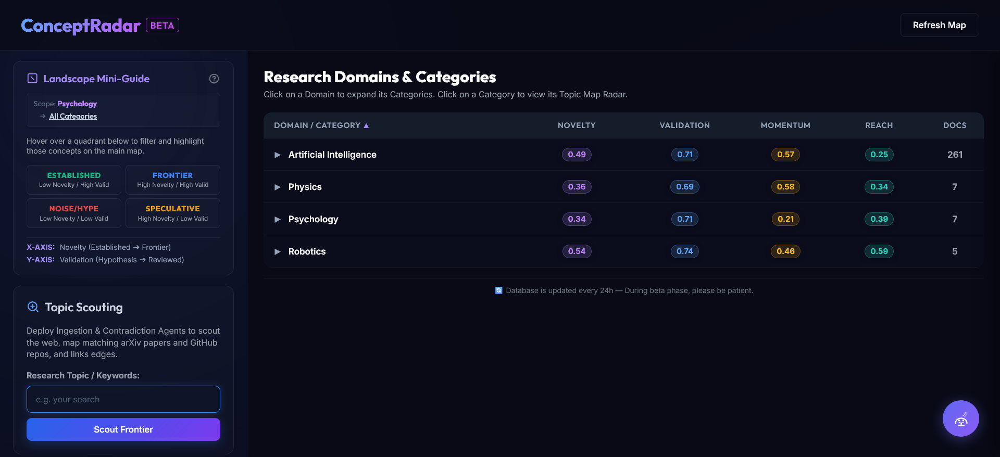

### Domains Expanded — AI Categories with Metrics
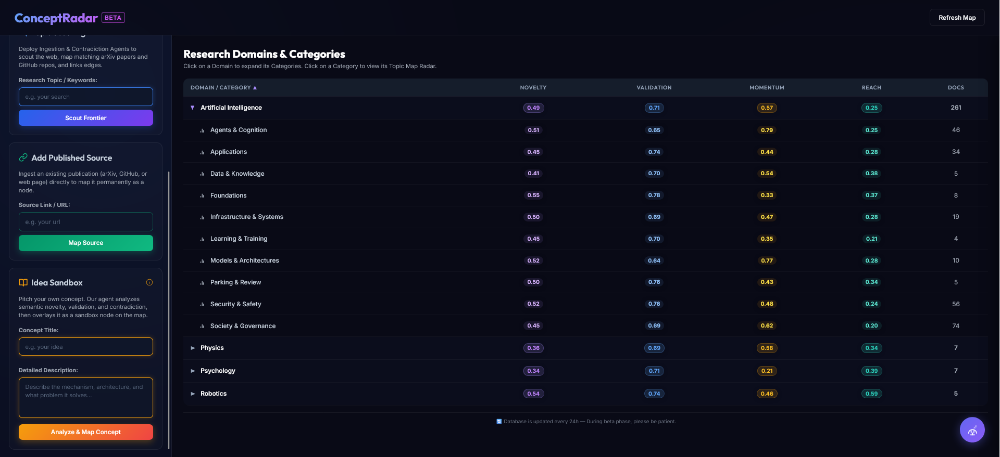

### Sidebar — Scout, Add Source, Idea Sandbox
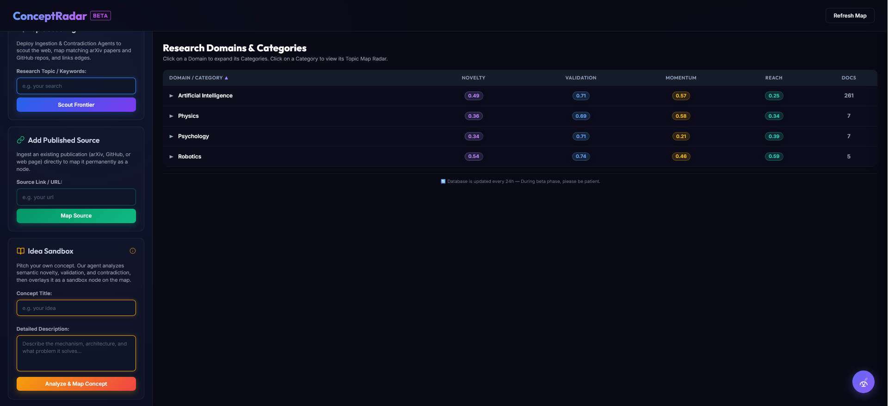

### Radar Map — All Concepts with Detail Card
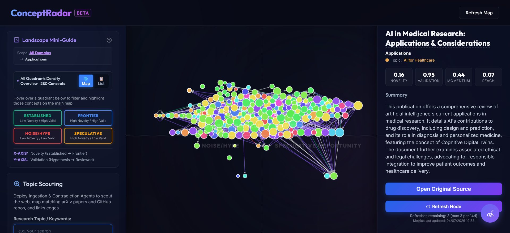

### Detail Card — Concept with Relationships
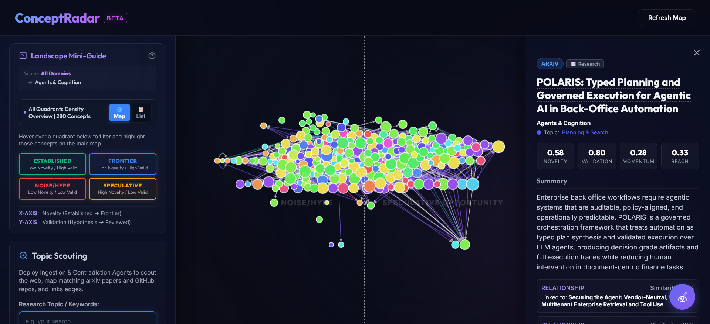

### Quadrant Filter — Frontier Concepts
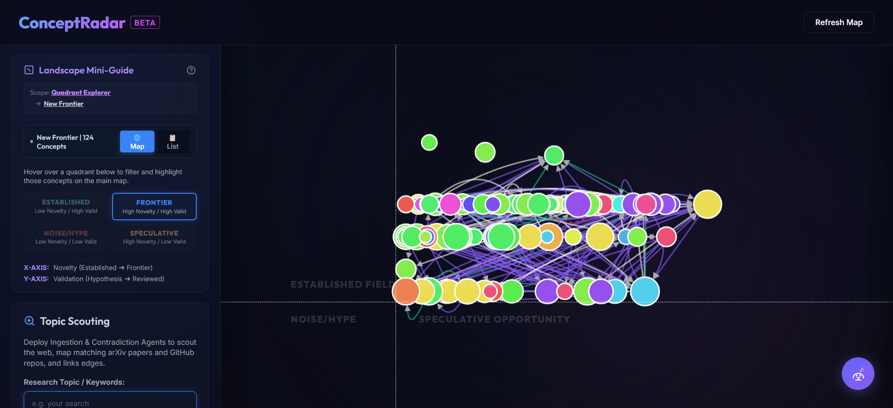

### Quadrant Filter — Established Concepts
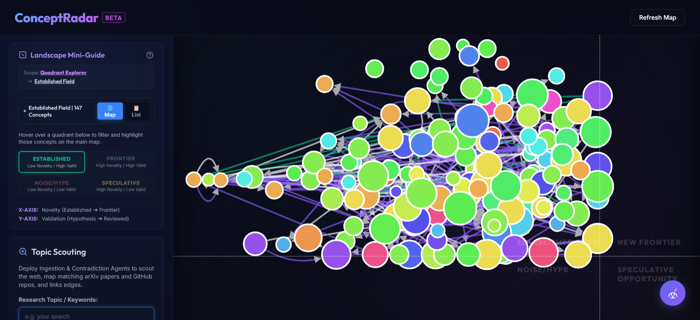

### Chatbot — ConceptRadar Agent
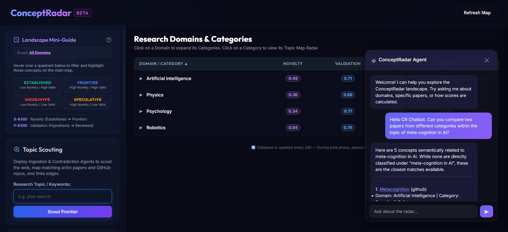

---

## 🏗️ Architecture

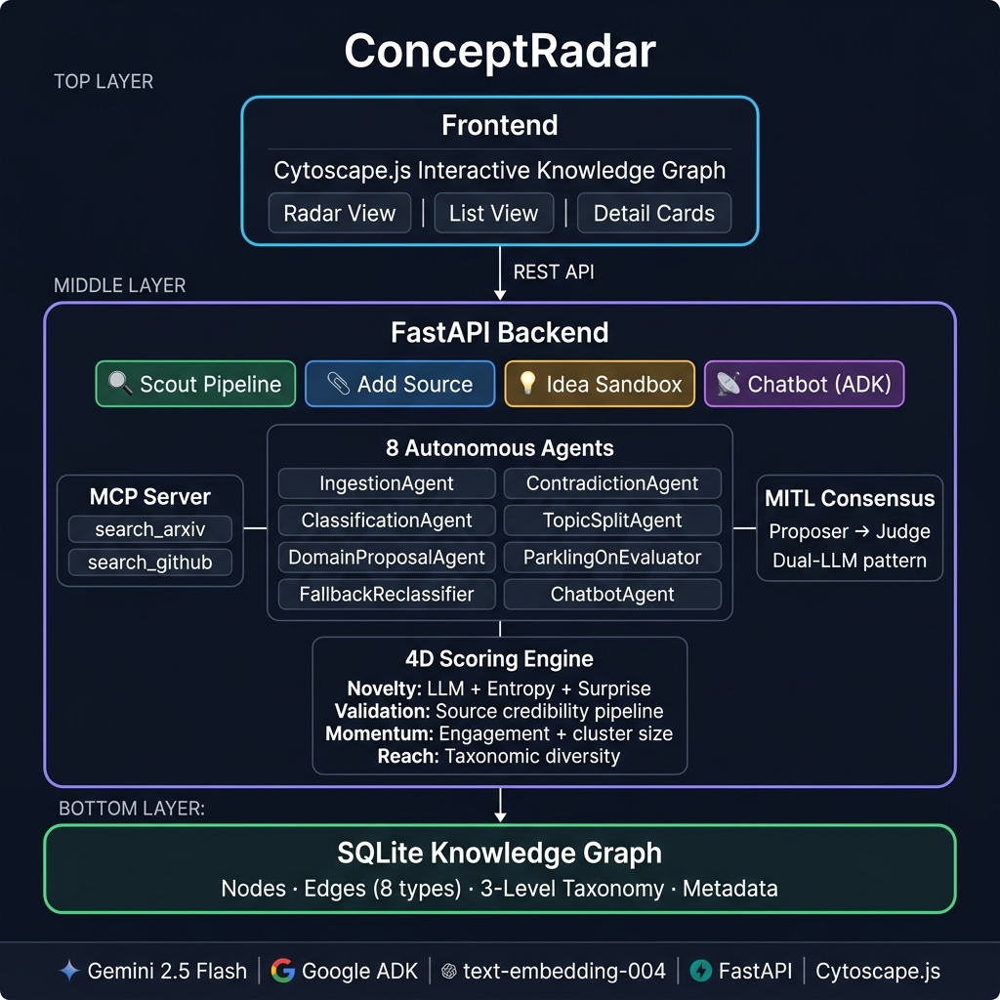

### Agents & MITL (Model-in-the-Loop) Architecture

ConceptRadar replaces traditional human-in-the-loop oversight with a **Model-in-the-Loop (MITL)** pattern: autonomous agents make informed decisions using LLM reasoning, with critical structural changes validated through a dual-LLM proposer+judge consensus. This enables fully autonomous operation with built-in quality assurance.

| Agent | Role | Pattern |
|-------|------|---------|
| **IngestionAgent** | Content extraction, embedding generation, metadata enrichment | LLM extracts structured metadata |
| **ContradictionAgent** | Compares each concept against peers, scores information gain | LLM evaluates novelty against peer context |
| **ClassificationAgent** | Taxonomy assignment (domain → category → topic) with nearest-neighbor fallback | LLM classifies; falls back to embedding similarity when LLM fails |
| **TopicSplitAgent** | When a topic exceeds 50 nodes, proposes splits | MITL: Proposer LLM + Judge LLM consensus |
| **DomainProposalAgent** | Proposes entirely new taxonomy branches | MITL: Proposer LLM + Judge LLM consensus |
| **ParkingLotEvaluator** | Periodically re-evaluates unclassifiable concepts | LLM re-attempts as taxonomy evolves |
| **FallbackReclassifier** | Upgrades nearest-neighbor classifications to LLM-verified | LLM replaces initial embedding-based assignment |
| **ChatbotAgent** | Stateful conversational research assistant (30-min sessions) | 3 skill-based tools (prompt injection protection by design) |

#### Autonomous Taxonomy Evolution

The taxonomy self-organizes without human intervention:

- **Parking Lot**: Concepts that don't fit existing taxonomy are quarantined — never force-classified into wrong categories
- **Periodic Re-evaluation**: Parking lot concepts are re-examined as the taxonomy grows — what didn't fit last month may fit now
- **Topic Splitting**: Overcrowded topics are split via MITL consensus (proposer suggests, judge validates)
- **Domain Proposals**: When enough unclassifiable concepts accumulate in parking, the system proposes entirely new knowledge domains via MITL consensus
- **Fallback Reclassification**: Concepts initially classified by nearest-neighbor embedding (used when the LLM fails) are periodically upgraded to full LLM-verified classifications

---

## 🔐 Security & Safety

ConceptRadar implements **security-in-depth** — multiple independent layers that each protect against different threat vectors:

### Security (Application-side)
- **Constrained chatbot**: The chatbot agent cannot make outbound network requests or access the filesystem — it can only query the internal knowledge graph through predefined skill tools
- **Prompt injection protection (chatbot)**: Chatbot skills act as a security boundary — user input never directly reaches the system prompt. Skills are predefined function tools with typed parameters, preventing injection
- **System prompt isolation**: The chatbot's system prompt is not exposed or modifiable through user interaction
- **Input validation (ingestion pipelines)**: Scout and Add Source inputs are validated through URL blacklisting, content adequacy checks, and structured LLM prompts with strict output schemas — reducing (but not fully eliminating) injection surface. Further hardening of all input fields is on the roadmap

### Safety (User-side)
- **Private Idea Sandbox**: User-submitted ideas are evaluated and scored in isolation. The user decides whether to promote (with or without attribution) or delete — leaving no traces, with privacy fully respected
- **Content adequacy gate**: Ideas must meet a minimum coherence threshold (100+ words, LLM-verified non-gibberish) to prevent spam and protect graph quality
- **Duplicate detection**: Before ingestion, concepts are checked against existing knowledge via embedding similarity + LLM reranking

### Efficiency
- **URL blacklist**: Sites that block scrapers or return unreadable content are recorded so the system doesn't retry known-broken URLs
- **Rate limiting**: Gemini API calls are queued and rate-limited to prevent quota exhaustion
- **Rolling refresh**: Instead of refreshing all nodes at once, the system updates a configurable percentage per cycle — ensuring the entire graph is refreshed within a month while keeping each cycle lightweight and scalable
- **Soft-delete retirement**: Nodes with broken links are retired (hidden) rather than deleted, maintaining traceability and audit history

---

## 🗂️ Taxonomy Structure

ConceptRadar uses a **3-level hierarchical taxonomy** with metadata at every level:

```
Level 1: Domains       — e.g., AI, Physics, Robotics
Level 2: Categories    — e.g., Agents & Cognition, Foundations, Security & Safety
Level 3: Topics        — e.g., Agent Architectures, Adversarial ML (grows autonomously)
         └── Nodes     — Individual concepts (papers, repos, ideas, blog posts)
```

Each level carries metadata, and the taxonomy evolves autonomously through the MITL agents described above.

---

## 🚀 Getting Started

### Prerequisites
- Python 3.11+
- Google AI API key (Gemini) — get one at [ai.google.dev](https://ai.google.dev)

### Installation

```bash
# Clone the repository
git clone https://github.com/ChaSpl/ConceptRadar.git
cd ConceptRadar

# Create virtual environment
python -m venv venv
source venv/bin/activate  # On Windows: venv\Scripts\activate

# Install dependencies
pip install -r requirements.txt

# Set up environment variables
cp .env.example .env
# Edit .env and add your GOOGLE_API_KEY
```

### Running

```bash
# Start the server
python run.py

# Open in browser
# http://localhost:8000
```

---

## 📁 Project Structure

```
ConceptRadar/
├── src/
│   ├── main.py              # FastAPI app, API endpoints, scoring orchestration
│   ├── agent.py             # ADK agents (Ingestion, Contradiction, Scouting)
│   ├── chatbot.py           # Chatbot agent with 3 skill-based tools
│   ├── scoring.py           # Novelty, validation, momentum calculations
│   ├── scouting.py          # Web search & discovery pipeline
│   ├── scraper.py           # URL content extraction & cleaning
│   ├── clustering.py        # Taxonomy classification, topic splitting, domain proposals
│   ├── db.py                # SQLite knowledge graph operations
│   ├── mcp_server.py        # MCP server integration
│   ├── rate_limiter.py      # Gemini API rate limiting
│   ├── validation.py        # URL and content validation
│   ├── taxonomy_examples.py # Taxonomy seed data
│   └── static/
│       ├── index.html       # Main UI (radar + list views)
│       ├── app.js           # Cytoscape.js graph rendering
│       └── styles.css       # UI styling
├── skills/                  # ADK skill definitions
│   ├── graph-explorer/      # Query the knowledge graph
│   ├── concept-analyzer/    # Deep-dive analysis
│   └── concept-comparator/  # Side-by-side comparison
├── .env.example             # Environment variable template
├── requirements.txt         # Python dependencies
├── LICENSE                  # Apache 2.0
└── README.md                # This file
```

---

## 🎓 Course Concepts Demonstrated

Built for the [Google x Kaggle AI Agents Intensive Course](https://www.kaggle.com/competitions/vibecoding-agents-capstone-project) (June 2026):

| Concept | Implementation |
|---------|---------------|
| **Multi-Agent Systems (ADK)** | 8 agents: Ingestion, Contradiction, Classification, TopicSplit, DomainProposal, ParkingLotEvaluator, FallbackReclassifier, Chatbot |
| **Agent Skills** | 3 skill-based tools in the chatbot — skills prevent prompt injection by design |
| **Memory & State** | SQLite persistent knowledge graph with 280+ scored concepts; stateful chatbot sessions with multi-turn context |
| **Security & Safety** | Security-in-depth: constrained chatbot, private idea sandbox, content adequacy gates, prompt isolation |
| **Evaluation** | 4 scoring dimensions (novelty, validation, momentum, reach) with 3-component percentile-normalized novelty |
| **Autonomous Operation** | MITL (Model-in-the-Loop): self-evolving taxonomy via dual-LLM consensus, parking lot pattern, rolling refresh |
| **MCP Server** | MCP server integration for external tool access |

---


## 🛠️ Tech Stack

- **Backend**: Python, FastAPI, Uvicorn
- **Frontend**: HTML, CSS, JavaScript, Cytoscape.js
- **AI/ML**: Google Gemini 2.5 Flash, Google ADK, text-embedding-004
- **Database**: SQLite (WAL mode)

---

## 🗺️ Roadmap — From Beta to Production

ConceptRadar is currently in **beta** — a fully functional system with 280+ scored concepts, but designed from the ground up to scale. The architecture (modular agents, SQLite → PostgreSQL-ready schema, rolling refresh, rate limiting) was built with production in mind.

### Security & Trust
- [ ] **Input hardening** — Extend prompt injection protection from the chatbot (already protected via skill boundaries) to all input fields (Scout, Add Source, Idea Sandbox) using structured output schemas and input sanitization
- [ ] **Agent drift control** — Integrate Google ADK Evaluation framework and Callbacks to monitor agent behavior over time, detect scoring drift, and flag anomalous classifications
- [ ] **Observability** — Google Cloud Operations (Logging, Tracing, Monitoring) for full audit trails of every agent decision — what was scored, why, and how it changed

### Scalability
- [ ] **Database migration** — SQLite → PostgreSQL/Cloud SQL for concurrent access and production workloads
- [ ] **Google Cloud Run deployment** — Containerized deployment with auto-scaling

### Scoring & Intelligence
- [ ] **Validation score enrichment** — Currently source-type-dominant, causing horizontal banding on the radar. Improvement planned

---

## 📄 License

This project is licensed under the Apache License 2.0 — see [LICENSE](LICENSE) for details.

---

## 👤 Author

**ChaSpl** — [GitHub](https://github.com/ChaSpl)

Built as a capstone project for the [Google x Kaggle AI Agents Intensive Course](https://www.kaggle.com/competitions/vibecoding-agents-capstone-project) (June 2026).
